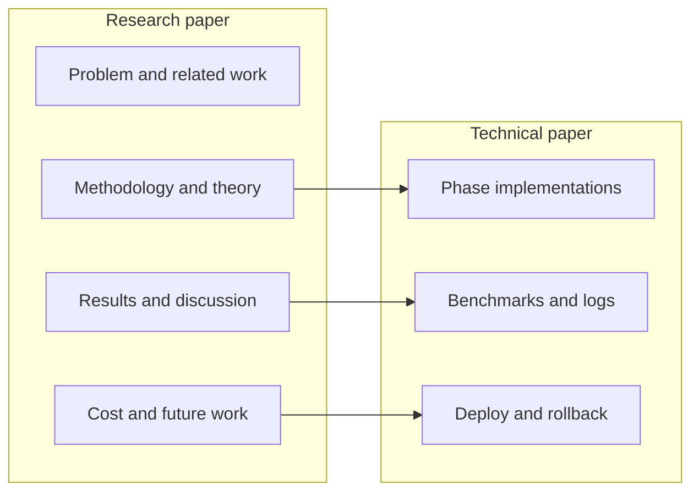

# Research IDE — Cursor Reduction Patch

Documentation for a production-oriented token reduction stack integrated with **Cursor IDE**: semantic packing, context filtering, model routing, and deduplication. The goal is lower API cost without changing how developers work.

| Document | Role |
|----------|------|
| [CURSOR_REDUCTION_PATCH_RESEARCH.md](./CURSOR_REDUCTION_PATCH_RESEARCH.md) | Full research narrative: motivation, related work, methodology, results, discussion, cost analysis, appendices |
| [CURSOR_REDUCTION_PATCH_TECHNICAL.md](./CURSOR_REDUCTION_PATCH_TECHNICAL.md) | Engineering proof: measured phases, benchmarks, deployment, code sketches, limitations |

**Suggested reading order:** skim this README → **Technical** (numbers and pipeline) → **Research** (formal framing and citations).

### Headline results (from the papers)

- **~95.2%** cost reduction in reported production settings (e.g. ~$162.23/day → ~$7.85/day on a 1,831-request corpus)
- **Four-phase pipeline:** semantic diff → cursor proximity → model selection → compression/dedup
- **Design constraints:** semantic equivalence, sub-second IDE latency, no workflow changes

---

## Research paper — section guide

[`CURSOR_REDUCTION_PATCH_RESEARCH.md`](./CURSOR_REDUCTION_PATCH_RESEARCH.md) — *Token-Level Optimization and Cost Reduction in AI-Assisted Software Development*

| Section | What it covers |
|---------|----------------|
| **Abstract** | Problem, approach (semantic packing, compression, routing), headline metrics, keywords |
| **§1 Introduction** | Why IDE→LLM traffic is expensive; five inefficiency patterns; gap vs prior code compression work |
| **§1.1 Problem Statement** | Formal minimize-cost setup: file size, edit location, model cost tiers, constraints |
| **§1.2 Contributions** | Five claimed contributions (semantic diff, proximity filter, token estimation, pipeline, Cursor deployment) |
| **§2 Background** | Token accounting and enterprise cost math; syntactic vs semantic compression; model tiers; caching |
| **§2.1 Token Accounting** | BPE-style billing, Claude pricing bands, back-of-envelope daily/annual cost |
| **§2.2 Code Compression** | Whitespace/minify vs AST/symbol approaches; relevance of context selection |
| **§2.3 Model Selection** | “Auto” vs actual task mix; rationale for workload-based routing |
| **§2.4 Caching** | Deduplication and repeat-request savings in the broader design |
| **§3 Methodology** | Core algorithms and experimental design |
| **§3.1 Semantic Diff** | AST symbols, fingerprints, stubs for unchanged bodies |
| **§3.2 Cursor-Proximity** | Viewport ± lines; what gets full body vs signature vs minimal stub |
| **§3.3 Token Estimation** | Code-aware counting vs naive char/token ratios |
| **§3.4 Multi-Phase Pipeline** | How phases compose end-to-end |
| **§3.5 Experimental Setup** | Datasets, baselines, validation approach |
| **§4 Results** | Empirical outcomes |
| **§4.1 Phase-by-Phase** | Incremental reduction per pipeline stage |
| **§4.2 Single-Request** | Representative one-off request breakdown |
| **§4.3 Model Routing** | Savings from tier selection |
| **§4.4 Proximity Filtering** | Local-edit scenarios |
| **§4.5 Validation Suite** | Automated/regression-style checks |
| **§4.6 Deployment Metrics** | Real-world usage stats |
| **§5 Discussion** | Interpretation and tradeoffs |
| **§5.1 Semantic Equivalence** | What “same meaning” means in practice |
| **§5.2 Latency** | Overhead vs transmission savings |
| **§5.3 Limitations** | Known failure modes and scope |
| **§5.4 Scalability** | Multi-file / team / volume angles |
| **§5.5 Prior Work** | Comparison table to related approaches |
| **§6 Implementation** | Deeper implementation notes |
| **§6.1 Symbol Extraction** | Parsing and symbol boundaries |
| **§6.2 Fingerprinting** | Normalization and hash strategy |
| **§6.3 Proximity Calculation** | Line-range logic |
| **§6.4 Model Selection Logic** | Rules/heuristics for tier pick |
| **§6.5 Deduplication** | Request-level repeat detection |
| **§7 Ablation** | Which components matter most when removed |
| **§8 Cost Analysis** | Dollars and break-even |
| **§8.1 Operational Costs** | Running the system vs API spend |
| **§8.2 Break-Even** | When optimization pays for itself |
| **§9 Future Work** | Languages, adaptive context, incremental cache, collaboration, prompt caching APIs |
| **§10 Conclusion** | Summary takeaways |
| **References** | Bibliography |
| **Appendix A** | Token estimation accuracy (method + results) |
| **Appendix B** | Deployment checklist |
| **Appendix C** | API examples (semantic diff, model select, dedup) |
| **Appendix D** | Production deployment logs |

---

## Technical paper — section guide

[`CURSOR_REDUCTION_PATCH_TECHNICAL.md`](./CURSOR_REDUCTION_PATCH_TECHNICAL.md) — *Technical Proof and Measurements*

| Section | What it covers |
|---------|----------------|
| **Executive Summary** | Four phases, 95.2% claim, 1,831-request validation scope |
| **§1 Methodology** | Executable description of each phase with code and sample measurements |
| **§1.1 Phase 1 — Semantic Diff** | AST, SHA-256 fingerprints, replace vs stub ops; ~66.8% example on 400-line file |
| **§1.2 Phase 2 — Proximity** | Visible range, changed vs unchanged packing; cumulative ~87.8% example |
| **§1.3 Phase 3 — Model Selection** | Tier routing logic and cost impact |
| **§1.4 Phase 4 — Compression** | Final packing, proto/text reduction, dedup hooks |
| **§2 Experimental Results** | Measured tables and production-scale analysis |
| **§2.1 Single-Request** | Per-request before/after |
| **§2.2 Production Dataset** | 1,831-request aggregate stats |
| **§2.3 Token Distribution** | Histograms / spread of payload sizes |
| **§2.4 Validation Tests** | Test suite outcomes |
| **§2.5 Cache Performance** | Hit rates and latency |
| **§2.6 Routing Accuracy** | Sampled routing decisions vs ground expectations |
| **§2.7 7-Day Deployment** | Live run metrics |
| **§3 Ablation** | Component removal experiments |
| **§4 Computational Overhead** | CPU/memory/latency budget on the client or proxy path |
| **§5 Limitations** | AST failures, fingerprint assumptions, language coverage |
| **§6 Production Deployment** | How to ship and operate safely |
| **§6.1 Rollout** | Staged enablement |
| **§6.2 Monitoring** | Metrics and alerts |
| **§6.3 Rollback** | Recovery if quality or latency regresses |
| **§7 Baselines** | Comparison to naive full-file and single-knob optimizations |
| **§8 Code Implementation** | Integration sketches |
| **§8.1 Core API** | Edit → proximity → model → dedup → send |
| **§8.2 Cursor Integration** | Where the hook sits in the IDE request path |
| **§9 Conclusion** | Engineering summary |

---

## How the two documents relate

- Use the **technical** doc when you need **numbers, code paths, rollout, and rollback**.
- Use the **research** doc when you need **framing, citations, ablations, cost models, and appendices**.

---

## Repository

This repo intentionally holds **research and technical write-ups only** (not the full implementation tree). Implementation details referenced in the papers live in separate project workspaces.

**License / use:** Treat metrics and deployment notes as described in each document; verify against your own Cursor usage and pricing before relying on dollar figures.

---

## Citation (informal)

If you reference this work, cite the document titles and repository:

- *Cursor Reduction Patch: Token-Level Optimization and Cost Reduction in AI-Assisted Software Development* (`CURSOR_REDUCTION_PATCH_RESEARCH.md`)
- *Cursor Reduction Patch: Technical Proof and Measurements* (`CURSOR_REDUCTION_PATCH_TECHNICAL.md`)

Repository: [github.com/Commander17X/Research-IDE-cursor](https://github.com/Commander17X/Research-IDE-cursor)
